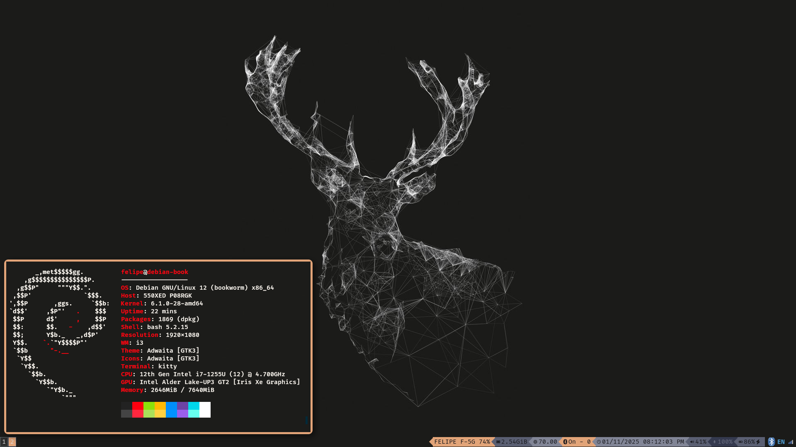
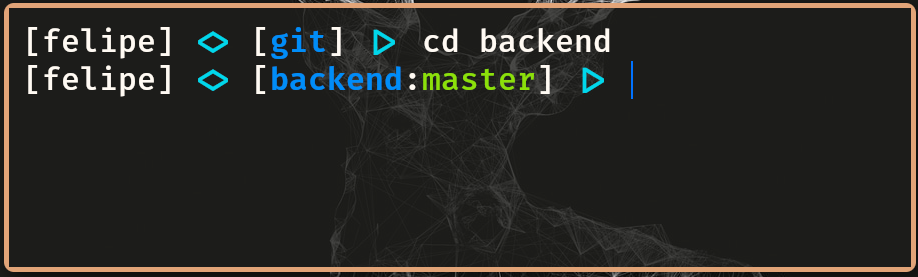

# I3

I3 is a Linux window manager that enables you to use your desktop based on keyboards shortcuts

You can use different programs to create your own configuration.

Here is a preview of my configuration:

<p align="center"> 
  
</p>

## Dependencies

This configuration was made over a Debian 12. Since this distro has old packages version in the official repository, you might be interested on compile some dependencies.

- [i3](https://i3wm.org/) - Window tile manager
- [picom](https://github.com/yshui/picom) - Required compile to be able to use animations
- compton - Used to enable transparency
- [kitty](https://sw.kovidgoyal.net/kitty/) - Terminal
- [allacritty](https://alacritty.org/) - Terminal (alternative)
- [rofi](https://github.com/davatorium/rofi) - Required compile. It's a menu search
- [bumblebee-status](https://github.com/tobi-wan-kenobi/bumblebee-status) - Required compile to use latest plugins
- [firacode](https://www.nerdfonts.com/font-downloads) - Font that have ligature support

## Configuration

In this configuration I'm using `kitty` terminal, because it have support for ligatures, but `alacritty` is a good choice too (but without ligatures support).

Instead of using `dmenu`, the default menu search for `i3`, this configuration uses `rofi`.

Instead of using `i3blocks` or `i3status`, this configuration uses `bumblebee-status`. Some of used plugins might not works, usually because requires some python lib. To fix it just open the plugin files and check if you have the libs installed.

Move `config` files to your `.config` directory.

### Rofi configuration

To add the `material` theme to `rofi`, first copy the following file

```sh
# Ensure the directory exists
mkdir -p ~/.local/share/rofi/themes
cp rofi/material.rasi ~/.local/share/rofi/themes/
```

### PS1

The `PS1` environment variable defines the prompt format in your terminal.

<p align="center"> 
  
</p>

Copy and paste the following config in your `.bashrc` file

```sh
# PS1 Config in terminal
_show_git_status() {
  # Get the current git branch and colorize to indicate branch state
  # branch_name+ indicates there are stash(es)
  # branch_name? indicates there are untracked files
  # branch_name! indicates your branches have diverged
  local unknown untracked stash clean ahead behind staged dirty diverged
  unknown='0;34'   # blue
  untracked='0;32' # green
  stash='0;32'     # green
  clean='0;32'     # green
  ahead='0;33'     # yellow
  behind='0;33'    # yellow
  staged='0;96'    # cyan
  dirty='0;31'     # red
  diverged='0;31'  # red

  if [[ $TERM = *256color ]]; then
    unknown='38;5;20'   # dark blue
    untracked='38;5;76' # mid lime-green
    stash='38;5;76'     # mid lime-green
    clean='38;5;82'     # brighter green
    ahead='38;5;226'    # bright yellow
    behind='38;5;142'   # darker yellow-orange
    staged='38;5;214'   # orangey yellow
    dirty='38;5;202'    # orange
    diverged='38;5;196' # red
  fi

  branch=$(git status 2>/dev/null | head -n1 | awk '{print $NF}')
  if [[ -n "$branch" ]]; then
    git_status=$(git status 2>/dev/null)
    # If nothing changes the color, we can spot unhandled cases.
    color=$unknown
    if [[ $git_status =~ 'Untracked files' ]]; then
      color=$untracked
      branch="${branch}?"
    fi
    if git stash show &>/dev/null; then
      color=$stash
      branch="${branch}+"
    fi
    if [[ $git_status =~ working.*clean ]]; then
      color=$clean
    fi
    if [[ $git_status =~ 'Your branch is ahead' ]]; then
      color=$ahead
      branch="${branch}>"
    fi
    if [[ $git_status =~ 'Your branch is behind' ]]; then
      color=$behind
      branch="${branch}<"
    fi
    if [[ $git_status =~ 'Changes to be committed' ]]; then
      color=$staged
    fi
    if [[ $git_status =~ 'Changed but not updated' ||
      $git_status =~ 'Changes not staged' ||
      $git_status =~ 'Unmerged paths' ]]; then
      color=$dirty
    fi
    if [[ $git_status =~ 'Your branch'.+diverged ]]; then
      color=$diverged
      branch="${branch}!"
    fi
    # Print the colored branch name + indicators
    printf "\[\033[%sm\]%s" "$color" "$branch"
    # Reset the color
    printf "\[\033[0m\]"
  fi
  return 0
}

_show_last_exit_status() {
  # Display the exit status of the last run command
  exit_status=$?
  if [[ "$exit_status" -ne 0 ]]; then
    echo "Exit $exit_status"
  fi
}

_build_prompt() {
  local blue cyan clean
  blue='\[\033[01;34m\]'
  cyan='\[\033[01;36m\]'
  clean='\[\033[00m\]'

  local git_status prompt_dir
  if [[ $USE_GIT_PROMPT != 0 ]]; then
    git_status=$(_show_git_status)
    if [[ -n "$git_status" ]]; then
      git_status=":${git_status}"
    fi
  fi

  prompt_dir=$(basename "${PWD}")
  if [[ "${PWD}" == "${HOME}" ]]; then
    prompt_dir="~/"
  fi

  # Not really sure this works the way I'd like
  # Set xterm title
  printf "\033]0;%s\007" "$HOSTNAME"
  if [[ -n "$TMUX" || -n "$STY" ]]; then
    # Set tmux / screen window name
    printf "\033k%s\033\\" "$HOSTNAME"
  fi

  PS1="[${green}\u${clean}] ${cyan}<>${clean} [${blue}${prompt_dir}${clean}${git_status}] ${cyan}|>${clean} "
  return 0
}

PROMPT_COMMAND="_show_last_exit_status; _build_prompt;"
```

## Keyboard layout

For some reason, I was having some problems to use deadkeys with US layout specifically in the terminal.

So if you are not being able to do accents, a workaround that can be made is copy the `XCompose` file to your home directory

```sh
cp XCompose ~/.XCompose
```

Probably that is not the best solution, but it works.
